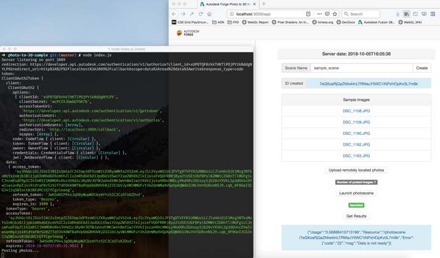

# Photo to 3D (photogrammetry) sample

**Forge API:** 

# Description
This sample illustrates the [Forge Reality Capture API](https://developer.autodesk.com/api/reality-capture-cover-page/)'s photogrammetry workflow:

- Create a photo scene
- Add photos to a scene
- Generate a 3D mesh model
- Obtain a download link for the model

### Thumbnail

# Setup
## Prerequisites
1. **Forge Account**: Learn how to create a Forge Account, activate subscription and create an app at [this tutorial](http://learnforge.autodesk.io/#/account/);
2. [Node.Js](https://nodejs.org) and basic knowledge of JavaScript;
3. [Visual Studio Code](https://code.visualstudio.com/) or any other code editor.

For using this sample, you need an Autodesk developer credentials. Visit the [Forge Developer Portal](https://developer.autodesk.com), sign up for an account, then [create an app](https://developer.autodesk.com/myapps/create). For this new app, use `https://localhost:3000/api/forge/callback/oauth` as Callback URL. Finally take note of the **Client ID** and **Client Secret**. 

##Running locally

For localhost testing:

- FORGE\_CLIENT\_ID and set it to above-mentioned **Client ID**
- FORGE\_CLIENT\_SECRET and set it to above-mentioned **Client Secret**
- FORGE\_CALLBACK\_URL and set it to `https://localhost:3000/api/forge/callback/oauth`

1. Clone this project or download it. It's recommended to install [GitHub desktop](https://desktop.github.com/). To clone it via command line, use the following (**Terminal** on MacOSX/Linux, **Git Shell** on Windows):

    	git clone https://github.com/Autodesk-Forge/reality.capture-nodejs-photo.to.3d.git

2. Using the command line, go into newly created `reality.capture-nodejs-photo.to.3d` folder (make sure sure that the current directory contains `package.json`) and type:

		npm install
	
	to install all the dependencies.

3. Using the command line, type  

		node index.js
	to start the local server
	
4. Open a browser and navigate to: 
		
		http://localhost:3000

## Deployment

To deploy this application to Heroku, the **Callback URL** for Forge must use your `.herokuapp.com` address. After clicking on the button below, at the Heroku Create New App page, set your Client ID, Secret and Callback URL for Forge.

Watch [this video](https://www.youtube.com/watch?v=Oqa9O20Gj0c) on how deploy samples to [Heroku](https://heroku.com).

# Further Reading

Documentation:

- [OAuth API](https://forge.autodesk.com/en/docs/oauth/v2/)
- [Reality Capture API](https://forge.autodesk.com/en/docs/reality-capture/v1)

Tutorials:

- [Create 3D Mesh from Photos](https://forge.autodesk.com/en/docs/reality-capture/v1/tutorials/create-3d-mesh-from-photos/)

Blogs:

- [Forge Blog](https://forge.autodesk.com/blog/hitchhikers-guide-reality-capture-api)

Other samples:

- [reality.capture-go-photoII3D
](https://github.com/apprentice3d/reality.capture-go-photoII3D)
- [reality.capture-go-cli
](https://github.com/apprentice3d/reality.capture-go-cli)

# License

This sample is licensed under the terms of the [MIT License](http://opensource.org/licenses/MIT). Please see the [LICENSE](LICENSE) file for full details.

# Written by

Eugene Chua [eugene.chua@autodesk.com](eugene.chua@autodesk.com)

## Updated By

- [September 2018]: Denis Grigor [denis.grigor@autodesk.com](denis.grigor@autodesk.com), [Forge Partner Development](http://forge.autodesk.com)

